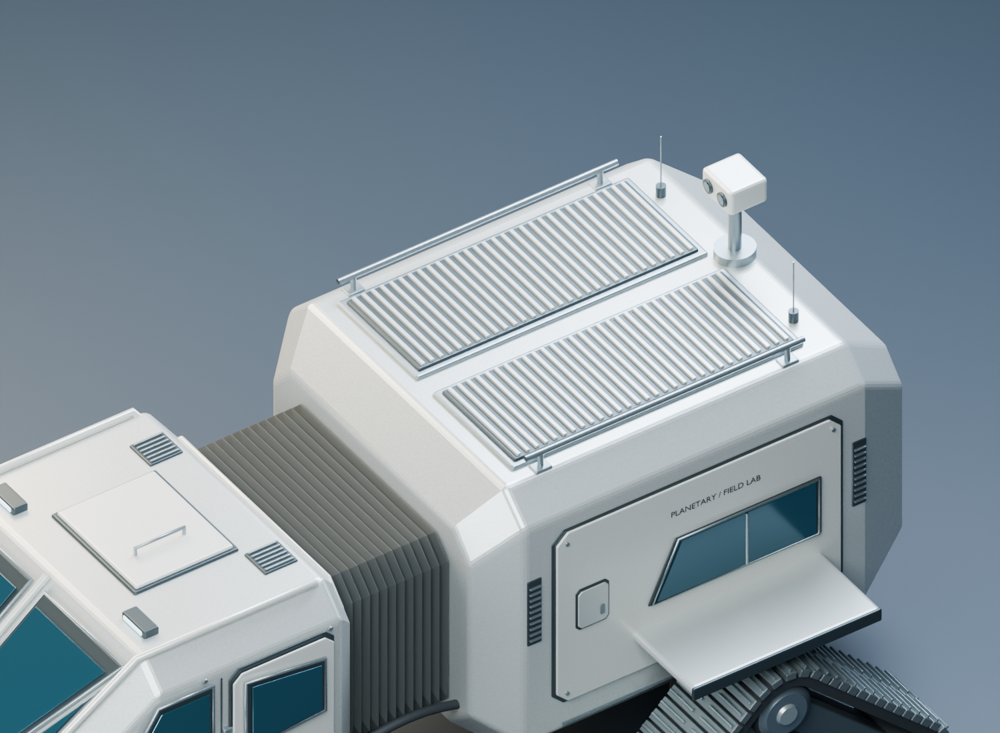
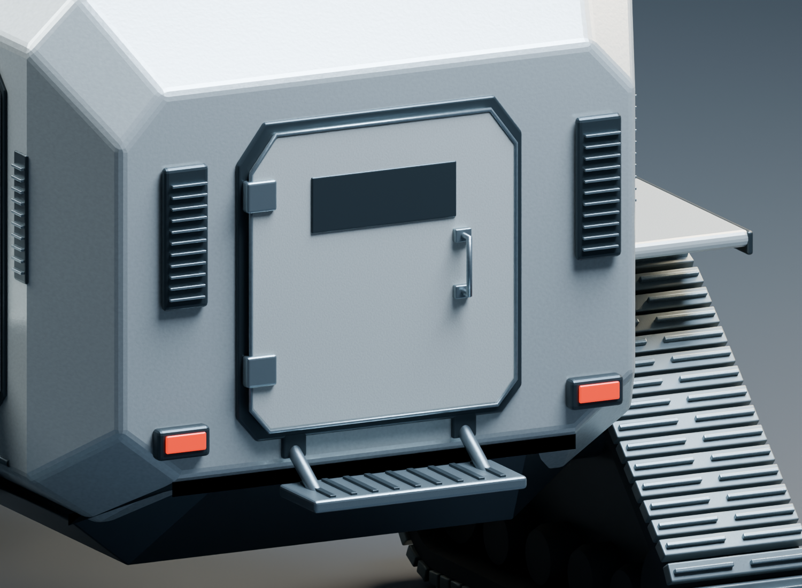

# Blender Asset Factory — project home

**0.5.0 · Private development release**

Build in Blender. Check geometry. Preserve the source. Prepare a separate runtime export.

## Explore

| Page | Purpose |
| --- | --- |
| [README](../README.md) | Overview and capabilities |
| [Getting started](GETTING_STARTED.md) | Open the rover or bootstrap the factory |
| [KHEPRI example](../examples/khepri/README.md) | Model, export, reference, and QA |
| [Release 0.5.0](releases/0.5.0.md) | Included work, verification, and limitations |
| [Pipeline design](IDEAL_AI_GAME_ASSET_PIPELINE.md) | Reference-first production direction |
| [Active project](../knowledge/active-project.json) | Current state and next action |

## Latest hull revision

Roof equipment now has seated bases, the sensor head connects to its mast, side panels have fewer overlapping outlines, and the airlock uses a shallow frame with attached hardware.

| Roof and sensor | Rear hatch and step |
| --- | --- |
|  |  |

Blender geometry and export checks pass. Runtime optimization and Three.js acceptance remain the next validation stage.

This is a Markdown landing page inside the private repository. Public GitHub Pages hosting is not enabled.
