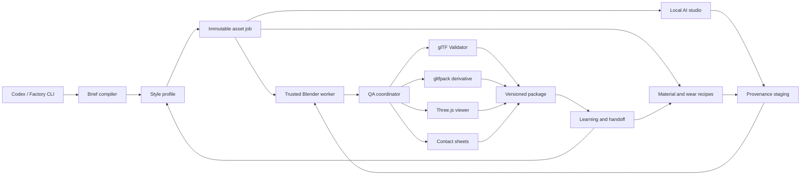

# Style-Neutral Self-Improving Blender Asset Factory Design

**Date:** 2026-07-18

**Status:** Approved architecture

**Canonical root:** `G:\DevWork\GameDev\BlenderAssetFactory`

**Model root:** `G:\LLMs`

## 1. Purpose

Build a local-first, style-neutral production system that lets Codex and Blender create, evaluate, package, and improve game-ready Three.js asset packs. The first production profile is `ps1_ww2`, but no permanent factory component may assume that profile or constrain future art styles.

The repository, not a chat transcript, is the durable authority for factory knowledge. A new Codex conversation or replacement computer must be able to recover the current capabilities, active project, tool versions, learned practices, and continuation point from files under the canonical root.

## 2. Goals

- Keep all tools, caches, projects, generated artifacts, and knowledge on drive `G:`.
- Store all AI model weights beneath `G:\LLMs`.
- Preserve Blender as the authority for geometry, UVs, rigs, animation, baking, rendering, and source exports.
- Use an external factory orchestrator to coordinate Blender, local AI tools, validators, and Three.js previews through bounded adapters.
- Support many styles through versioned data profiles rather than hard-coded aesthetic assumptions.
- Improve after every project by promoting evidenced lessons into knowledge, recipes, profiles, evaluations, and regression tests.
- Reproduce the toolchain from pinned manifests without polluting system Python or relying on global `PATH` entries.
- Produce portable Blend, GLB, preview, report, and manifest deliverables with recorded provenance.

## 3. Non-goals

- The factory will not train or fine-tune foundation models automatically.
- It will not permit generated 3D output to bypass topology, UV, licensing, or export validation.
- It will not allow ComfyUI, Krita, ArmorPaint, or external tools to overwrite authoritative assets directly.
- It will not turn a project-specific observation into a universal art rule without evidence.
- It will not require paid cloud GPUs for the core workflow.
- It will not make TRELLIS or Hunyuan3D hard dependencies while their official implementations require NVIDIA CUDA.

## 4. Architectural Choice

Use a style-neutral external orchestrator with trusted Blender workers.

The factory command line compiles briefs into immutable job contracts, loads a style profile, stages approved inputs, invokes bounded tool adapters, and publishes only validated outputs. Blender performs authoritative content work. ComfyUI and painting tools produce staged sources. Validation and runtime preview happen outside Blender so Blender export success is never treated as proof of runtime correctness.



## 5. Storage Contract

All factory-owned paths must resolve to drive `G:`. Startup validation must reject configuration that would write factory content to another drive.

```text
G:\DevWork\GameDev\BlenderAssetFactory\
|-- AGENTS.md
|-- README.md
|-- bootstrap\
|-- factory\
|-- profiles\
|-- knowledge\
|-- recipes\
|-- evaluations\
|-- projects\
|-- assets\
|-- tools\
|-- tests\
|-- reports\
|-- recovery\
|-- tmp\
`-- .tooling\

G:\LLMs\
|-- comfyui\
|-- checkpoints\
|-- controlnet\
|-- clip\
|-- vae\
|-- loras\
|-- upscale\
|-- segmentation\
`-- manifests\
```

`.tooling` contains isolated environments and installed third-party applications and is excluded from Git. `tools` contains small tracked adapters, lockfiles, checksums, and installation manifests. Large model binaries are excluded from Git; their expected relative paths, hashes, licenses, source URLs, and compatibility metadata are tracked under `G:\LLMs\manifests` and mirrored in transfer manifests.

## 6. Core Components

### 6.1 Factory CLI

Provide one PowerShell entry point, `factory.ps1`, backed by focused Python modules. Initial public commands are:

- `setup`: install or restore pinned tools beneath `.tooling`.
- `doctor`: report Blender, bridge, tools, GPU backend, model inventory, ports, and writable paths.
- `brief`: compile a human brief into a validated asset-job contract.
- `build`: execute an authoritative Blender builder through the trusted bridge or background worker.
- `validate`: run host, Blender, glTF, texture, provenance, and package checks.
- `optimize`: create a non-authoritative optimized GLB derivative.
- `preview`: run the local Three.js reference viewer and capture the engine view.
- `report`: create contact sheets and machine-readable QA results.
- `learn`: close a project, record observations, evaluate candidate lessons, and refresh handoff files.
- `resume`: print or execute the next safe action from the active-project state.
- `verify`: run the complete factory regression suite.

Commands must return nonzero exit codes on failure and emit a versioned JSON result in addition to concise human-readable output.

### 6.2 Immutable Asset Job

Every build consumes a JSON job containing:

- Asset identity and display name
- Style profile and exact profile version
- Dimensions, axes, units, pivot, sockets, and scale reference
- Geometry, collision, material, draw-call, texture, and file-size budgets
- Required deliverables and preview views
- Material and wear story
- Input files with provenance records
- Builder identity and allowed output root
- Evaluation thresholds
- Deterministic seed values

The build records the normalized job hash in its manifest. Tools may add reports but may not silently modify the accepted contract.

### 6.3 Trusted Blender Adapter

Use the existing hardened loopback bridge and transactional publication design. The adapter must:

- Locate Blender 5.2 explicitly at `G:` configuration or the discovered executable path; it must not depend on `PATH`.
- Enforce builder identity and canonical/worktree path restrictions.
- Support visible bridge execution and background test execution.
- Stage exports under unique run tokens.
- Preserve recovery files before visible-scene replacement.
- Publish only after sentinel completion and validator success.
- Expose deterministic stages for geometry, material, UV, lighting, render, export, and reporting.

Blender remains the authority for `.blend` source files. Optimized GLBs are always derivatives of a validated authoritative GLB.

### 6.4 Tool Adapters

Each external tool receives a versioned adapter with `probe`, `install`, `invoke`, and `verify` behavior. An unavailable optional tool must produce a structured capability result, not crash unrelated workflows.

- **ComfyUI:** local AMD-compatible concept, image, mask, inpainting, decal, and texture-source generation. Outputs enter provenance staging.
- **Krita AI Diffusion:** interactive painting client connected to the same ComfyUI backend.
- **Material Maker:** procedural source-material and brush authoring.
- **ArmorPaint:** optional hero-asset painting and manual refinement.
- **BlenderProc:** isolated procedural render and dataset/diagnostic jobs; it does not replace the trusted asset builder.
- **glTF Validator:** mandatory release gate for every GLB.
- **gltfpack:** optional optimization derivative with pixel-atlas UV precision tests.
- **Three.js viewer:** mandatory runtime truth for released Three.js packs.
- **TRELLIS and Hunyuan3D:** provider interfaces with local capability disabled unless a verified AMD implementation passes health and output tests. They are never required for core asset production.

## 7. Style Profiles

Profiles are versioned directories containing schemas and declarative settings:

```text
profiles\
|-- schema\
|-- ps1_ww2\
|   |-- profile.json
|   |-- palette.json
|   |-- materials.json
|   |-- wear.json
|   |-- presentation.json
|   `-- evaluations.json
`-- examples\
```

A profile may define polygon-density ranges, faceting rules, texture sizes, filtering, palette behavior, dithering, material recipes, wear vocabulary, lighting, camera treatment, and visual evaluation thresholds. It must not redefine safety, provenance, filesystem, or export-validity rules.

The first `ps1_ww2` profile provides premium PS1-era WWII-inspired art direction while requiring original fictional asset designs where appropriate. It includes blued and parkerized steel, walnut, canvas, wool, mud, chipped paint, soot, oil, and period-appropriate value/palette guidance. The M42 remains an asset-specific contract within that profile.

## 8. Persistent Knowledge and Controlled Learning

### 8.1 Knowledge Layout

```text
knowledge\
|-- START_HERE.md
|-- FACTORY_STATE.md
|-- decisions\
|-- lessons\
|-- failures\
|-- art-principles\
|-- blender\
|-- materials\
|-- topology\
|-- threejs\
|-- references\
`-- project-summaries\
```

`START_HERE.md` is the minimal bootstrap for a new Codex conversation. `FACTORY_STATE.md` is generated from verified state and records current capabilities, versions, health, active project, and last successful full verification. Narrative knowledge files are paired with machine-readable metadata when automation consumes them.

### 8.2 Three Knowledge Scopes

- **Universal:** safety, topology hygiene, material reasoning, export rules, provenance, and evaluation methods.
- **Profile:** style-specific palettes, topology choices, texture treatment, recipes, presentation, and scoring.
- **Asset:** dimensions, mechanisms, exceptions, references, recovery state, and project decisions.

Promotion between scopes is explicit. Asset knowledge never becomes universal merely because one project succeeded.

### 8.3 Learning Promotion

Every completed or suspended project runs a closeout that records observations and proposes candidate lessons. A candidate can be promoted only when at least one of these conditions is recorded:

1. An automated regression or evaluation demonstrates the behavior.
2. The technique succeeds in at least two distinct assets.
3. The user explicitly approves it as an artistic rule.
4. It is retained as a clearly labeled asset-specific exception.

Promoted technical lessons require a regression test whenever the behavior is automatable. Promoted artistic lessons require before/after evidence or an evaluation rubric entry. Every promotion records source projects, scope, evidence, author, date, and supersession links.

The system never changes model weights, executes model training, or modifies trusted safety boundaries through `learn`.

### 8.4 Project Closeout Outputs

- Project summary and current/final state
- Successful and failed techniques
- Root causes and recoveries
- Material, wear, geometry, lighting, and export recipes discovered
- Evaluation scores and comparison images
- Candidate and promoted lessons
- Tool/version compatibility discoveries
- Exact continuation action if incomplete
- Regenerated `START_HERE.md`, `FACTORY_STATE.md`, and active-project manifest

## 9. Codex Bootstrap and Conversation Continuity

The root `AGENTS.md` must require future Codex sessions to:

1. Read `knowledge/START_HERE.md` and the active-project manifest.
2. Run `factory.ps1 doctor` before mutations.
3. Load the requested profile and asset contract.
4. Preserve trusted Blender bridge and recovery boundaries.
5. Consult applicable lessons and known failures.
6. Use test-first implementation for factory behavior changes.
7. Run technical and visual evaluations before completion claims.
8. Run project closeout and regenerate the handoff state.

The generated bootstrap must be concise enough to load at the start of every conversation and link to deeper knowledge rather than duplicating it.

## 10. Provenance and Licensing

Every imported or generated source receives a sidecar record containing source, author/provider, acquisition date, license, permitted uses, original hash, transformations, generating workflow/model when applicable, and consuming assets.

CC0 catalogs such as Poly Haven, ambientCG, Kenney, and Quaternius may be indexed, but assets are imported only when a project requests them. The factory must not imply ownership of third-party work. Unknown or incompatible licenses block publication.

AI-generated inputs record the local model, model hash, workflow hash, seed, prompt, negative prompt, and preprocessing sources. Generated sources remain staging inputs until reviewed and accepted.

## 11. Validation and Visual QA

Release validation contains independent gates:

- Contract and schema validation
- Filesystem and builder-identity validation
- Blender mesh, transforms, dimensions, manifoldness, UV, image, material, and packing checks
- Triangle, collision, draw-call, texture, and package budgets
- glTF Validator with zero errors
- Texture embedding and color-space inspection
- Optimizer comparison and pixel-atlas UV stability
- Three.js load and render smoke test
- Contact sheet with beauty, orthographic, silhouette, wireframe, UV, base-color, ORM, collision, and engine views
- Profile-specific visual rubric
- Provenance and license completeness

Machine checks block release. Visual rubric failures block release when they fall below the profile threshold; subjective warnings remain reviewable and are never disguised as objective errors.

## 12. Failure Handling and Recovery

- Every run uses a unique identifier and isolated staging directory.
- Authoritative outputs are replaced transactionally only after all mandatory gates succeed.
- Blender visible-scene updates create a recovery Blend first.
- Interrupted runs retain structured failure records and remove unsafe staging residue.
- `resume` proposes the next safe action based on sentinels and manifests; it does not infer success from file presence alone.
- Installers are idempotent and may repair a missing component without deleting user assets or model weights.
- Tool upgrades require a compatibility probe and regression run before the pinned version changes.

## 13. Transfer and Rebuild

The Git repository contains code, knowledge, profiles, recipes, manifests, lockfiles, checksums, small test fixtures, and transfer instructions. Large assets, models, caches, and tool environments remain outside Git but on `G:`.

Required recovery commands are:

```powershell
.\bootstrap\setup.ps1
.\factory.ps1 doctor
.\factory.ps1 restore-tools
.\factory.ps1 index-models G:\LLMs
.\factory.ps1 verify
.\factory.ps1 resume
```

A transfer manifest inventories all excluded dependencies by path, version, source, license, size, and hash. A replacement computer can restore tools from manifests and reuse or verify a copied `G:\LLMs` directory.

## 14. Security Boundaries

- Network services bind only to loopback unless the user explicitly changes the design.
- Builder scripts execute only from the canonical root or its trusted worktrees.
- Tokens and credentials never enter Git, generated reports, prompts, or asset manifests.
- External applications write only to their designated staging or cache roots.
- Install scripts must verify resolved paths before recursive move, cleanup, or replacement operations.
- Tool and model downloads record source URLs and hashes.
- No learning operation may modify bridge identity enforcement, path restrictions, recovery logic, or publication transactions.

## 15. Delivery Phases

The complete program is divided into independently testable subprojects. Each receives its own implementation plan and review gate.

1. **Foundation and memory:** canonical layout, configuration, CLI shell, doctor command, knowledge schema, Codex bootstrap, closeout, and transfer manifests.
2. **Release pipeline:** glTF Validator, gltfpack, Three.js reference viewer, contact sheets, transactional packaging, and QA reports.
3. **Local creative tools:** AMD ComfyUI, shared `G:\LLMs` inventory, Krita integration, Material Maker, ArmorPaint, and provenance staging.
4. **Blender automation:** trusted adapter consolidation, baking, reusable material/wear recipes, BlenderProc diagnostics, and visible/background parity.
5. **First profile and vertical slice:** `ps1_ww2`, completion of the M42, one modular character target, and a small trench kit validation scene.
6. **Hardening and transfer rehearsal:** clean-machine simulation, restore test, documentation, full regression, and generated conversation handoff.

Later phases may begin only when their consumed interfaces from earlier phases are stable. The M42 geometry and current Task 3 work remain preserved throughout foundation work.

## 16. Acceptance Criteria

The design is complete when all delivery phases satisfy these outcomes:

- `factory.ps1 doctor` identifies every mandatory and optional capability with actionable status.
- A new conversation can resume the correct active task using only repository bootstrap files.
- A copied repository plus `G:\LLMs` can restore and verify the toolchain on another Windows computer with drive `G:`.
- At least one non-PS1 sample profile proves that the core has no hard-coded WWII or PS1 assumptions.
- The M42 produces a validated authoritative Blend and GLB, optimized derivative, Three.js render, contact sheet, provenance report, and project closeout.
- A completed project produces candidate lessons, and an evidenced lesson can be promoted with a regression or visual evaluation.
- Mandatory release gates reject invalid geometry, missing textures, invalid GLB data, unsafe paths, incomplete provenance, and runtime load failures.
- ComfyUI operates locally on the RX 7900 XTX through a verified AMD backend or is reported as unavailable without breaking non-AI production.
- CUDA-only 3D providers remain optional and cannot block local production.

## 17. First Implementation Boundary

Implementation begins with Phase 1, Foundation and Memory. This phase creates no art and does not modify the dirty M42 Task 3 files. Its deliverable is a verified, repository-backed control plane capable of describing the current factory, detecting installed capabilities, preserving knowledge scopes, and handing the exact active task to a new Codex conversation.
