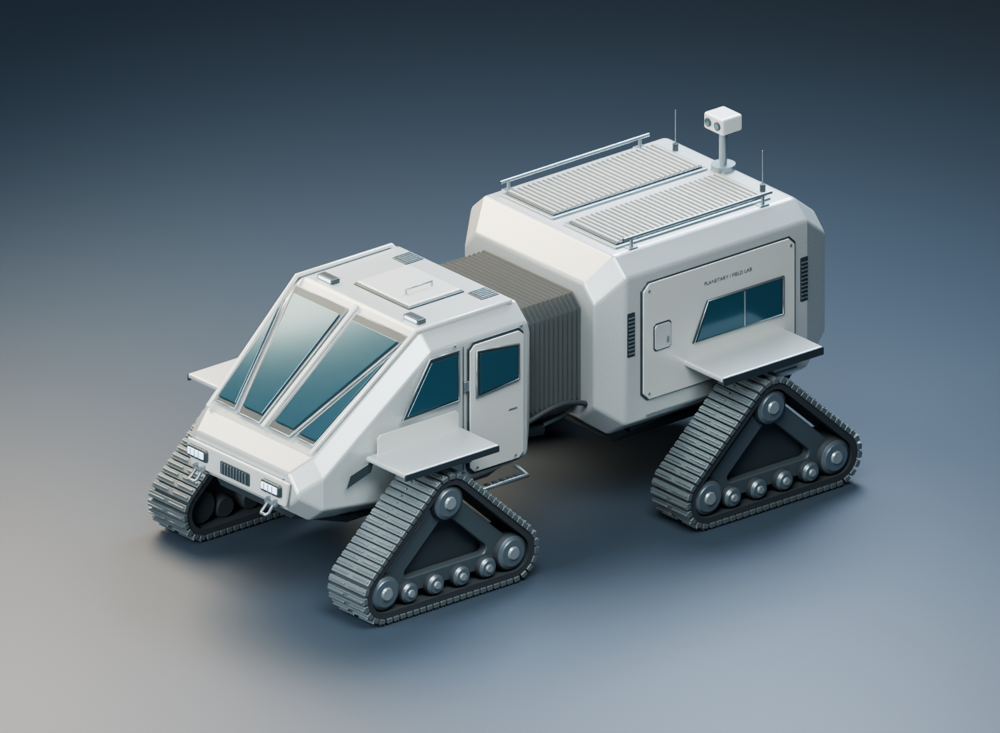

# KHEPRI planetary explorer

Four-track exploration vehicle, model revision 4, included in Blender Asset Factory 0.5.0.

| Path | Contents |
| --- | --- |
| [Source model](source/khepri-explorer.blend) | Editable Blender 5.2 source with packed blueprint |
| [GLB export](exports/khepri-explorer.glb) | Evaluated basic-PBR export |
| [Blueprint](reference/khepri-blueprint.png) | Generated concept reference |
| [Renders](renders/) | Vehicle, rear, roof, cabin roof, and airlock |
| [QA](qa/) | Attachment, track, and export reports |
| verify_attachments.py | 142 fitting checks and front guard clearance |
| verify_tracks.py | Tow mounts, rear clearance, axles, and lower rollers |
| verify_export.py | Reimports GLB and compares source geometry |

Revision 4 repairs floating roof/mast components, simplifies hull trim and the airlock, and connects guard/step supports. Earlier tow and track fixes are retained.

**451 meshes · 262,776 triangles · approximately 6.856 × 3.519 × 3.251 metres.**

This is a development asset. Three.js runtime QA, texture baking, LODs, and an animation-ready rig are not yet validated. The generated blueprint contains inconsistent projections.

See [verification commands](../../docs/GETTING_STARTED.md#recheck-khepri).
